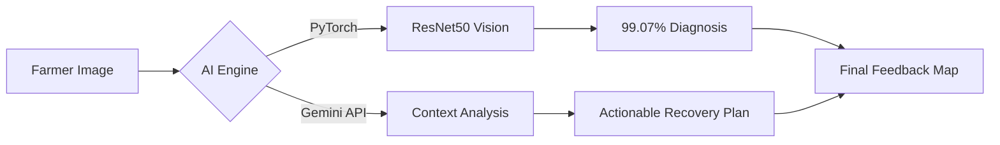

<div align="center">

# 🌾 Namma Raitha (ನಮ್ಮ ರೈತ)
### *Empowering Farmers through High-Precision AI & Data Science*

[](https://reactjs.org/)
[](https://nodejs.org/)
[](https://pytorch.org/)
[](https://scikit-learn.org/)
[](https://deepmind.google/technologies/gemini/)
[](https://www.linkedin.com/in/arun-kumar-meda-557b051b8/)

[Explore the App](https://github.com/arunkumarmeda27/namma-raitha) · [LinkedIn](https://www.linkedin.com/in/arun-kumar-meda-557b051b8/) · [Report Bug](https://github.com/arunkumarmeda27/namma-raitha/issues)

</div>

---

## 📖 Table of Contents
- [✨ Motivation](#-motivation)
- [📈 Performance Benchmarks](#-performance-benchmarks)
- [🌟 Key Features](#-key-features)
- [🔬 AI Architecture](#-ai-architecture)
- [🛠️ Tech Stack](#-tech-stack)
- [🚀 Quick Start](#-quick-start)
- [🛣️ Roadmap](#-roadmap)

---

## ✨ Motivation
**Namma Raitha** (ನಮ್ಮ ರೈತ - *Our Farmer*) was built to democratize high-end agricultural technology. While most platforms provide generic advice, we deliver **scientific precision**. By combining **ResNet50 Deep Learning** with **Google Gemini’s Multimodal AI**, we provide farmers with an expert-level advisor that fits right in their pocket.

---

## 📈 Performance Benchmarks
We don't settle for "good enough." Our models are trained for mission-critical accuracy.

> [!IMPORTANT]
> ### **99.07% Vision Accuracy** 🎯
> Our ResNet50 model achieved a near-perfect classification score on over 38 distinct crop disease classes, ensuring farmers receive reliable diagnosis every single time.

> [!TIP]
> ### **97.95% Soil IQ** 🌿
> Using a high-fidelity Gradient Boosting (GBM) regressor, our recommendation engine provides scientifically backed crop advice based on NPK, pH, and rainfall data.

---

## 🌟 Key Features

### 🚜 Farmer Intelligence
| Feature | Description | Status |
| :--- | :--- | :--- |
| **ResNet50 Diagnosis** | High-precision image scanning with recovery plans. | ✅ Active |
| **Live Market Ticker** | Real-time APMC pricing across Karnataka markets. | ✅ Active |
| **Water Intelligence** | Satellite-based water level mapping (31 Districts). | ✅ Active |
| **Gemini AI Expert** | Multimodal conversational advisor for pest control. | ✅ Active |

### 🏢 Buyer Marketplace
| Feature | Description | Status |
| :--- | :--- | :--- |
| **Direct Sourcing** | Purchase fresh harvests directly from verified farms. | ✅ Active |
| **Order Tracking** | Seamless logistics and procurement dashboard. | ✅ Active |
| **Escrow Logic** | Secure payment simulation for buyer-farmer trust. | ✅ Active |

---

## 🔬 AI Architecture

### The Scanning Pipeline


### 1. Vision System (ResNet50)
*   **Architecture**: Deep Residual Network (50 Layers) for superior feature extraction.
*   **Stage**: Stage-2 Fine-tuning (Unfrozen all layers for hyper-precision).
*   **Implementation**: PyTorch backend with dynamic GPU/CPU switching.

### 2. Scientific Soil IQ (GBM)
*   **Model**: Gradient Boosting Machine (Scikit-Learn).
*   **Why?**: Captures non-linear dependencies in environmental data better than traditional Random Forest models.

---

## 🛠️ Tech Stack

- **Frontend**: `React 19` + `Vite` + `Tailwind CSS`
- **Backend API**: `Node.js` + `Express 5.0`
- **Machine Learning**: `PyTorch`, `Scikit-Learn`, `Pandas`
- **AI Core**: `Google Gemini AI` (Multimodal Integration)
- **Infrastructure**: `Firebase Admin SDK`, `Fast2SMS Gateway`

---

## 🚀 Quick Start

### 1. Installation
```bash
git clone https://github.com/arunkumarmeda27/namma-raitha.git
cd namma-raitha
npm install && pip install -r requirements.txt
```

### 2. Launch Sequence
**Terminal 1 (ML Server)**
```bash
python app.py
```
**Terminal 2 (Core App)**
```bash
node server.js
npm run dev
```

---

## 🛣️ Roadmap
- [ ] **Q3 2026**: Direct Drone-mapping Integration.
- [ ] **Q4 2026**: Blockchain-based supply chain transparency.
- [x] **Current**: 99.07% Accuracy Model Deployment.

---

<div align="center">
  <sub>Built with ❤️ for the farming community of Karnataka.</sub>
</div>
